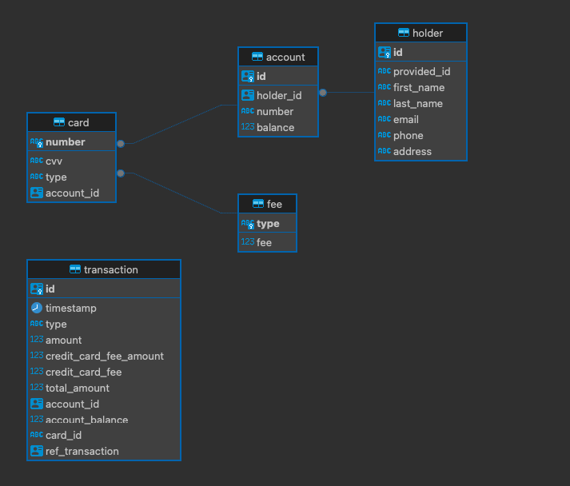

# **Simple Bank Account Simulation**

**Overview**

This project simulates a simple bank account system where users can transfer and withdraw money using debit or credit cards. The system charges an extra 1% fee for transactions done with a credit card.

The project is built using Spring Boot 3.2 and Java 21, with PostgreSQL as the database, and is containerized using Docker. GitHub is used for version control and CI. Swagger is available for API documentation.

**Requirements & Validations**

- Negative balance is not allowed.
- Each account must contain user details, card details, and the current balance.
- REST endpoints:
    - Check current available balance in all accounts.
    - Withdraw money.
    - Transfer money.
- Each account is linked to one credit or debit card.
- All transfers and withdrawals should be auditable.


**Assumptions**

- Each user has only one account.
- No different types of accounts are considered.
- Users can choose to have a credit card or not. A debit card is mandatory.
- Credit cards are pre-paid.
- The transfer system operates within the same bank.
- Cards Fee will be set via a rest endpoint [/v1/admin/cards/fee](http://localhost:8080/v1/admin/cards/fee)
- Accounts will have their balance increased via a rest endpoint [/v1/transactions/deposit](http://localhost:8080/v1/transactions/deposit)


**Future Considerations**

- Implement mechanisms to prevent the same transaction from being persisted twice.
- Add security mechanisms to prevent brute-forcing card details via the API.
- Create REST API to retrieve transaction history.
- Define how to expose audit data present in the transaction table (log stream, UI, API, monthly reports).
- Make card creation asynchronous to avoid account creation failure.
- Enhance encryption security (consider salting).
- Improve the performance of the transaction table (e.g., partitioning by timestamp).
- Setup tracing and metrics for observability using the preferred tool (Splunk, NewRelic or other).
- As the application grows, move the caching from local caching into distributed caching (Redis or other).


**Technologies Used**

- Spring Boot 3.2
- Java 21
- PostgresSQL
- Maven
- Docker
- Flyway
- GitHub
- GitHub Actions
- Swagger

**Data Base Diagram**



**Getting Started**

###### **Prerequisites**

- Docker
- Java 21
- Maven

###### Running the ApplicationRunning the Application

Clone the repository:

```shell
git clone https://github.com/JhonydePaula22/simple-bank-account.git
cd simple-bank-account
```

Compile the project:

```shel
mvn clean compile
```

Run unit tests

```shel
mvn test
```

Run integration-tests

```shel
mvn verify -Pintegration-tests
```

Start the services that the application will integrate with using Docker Compose:

The docker compose file is in the [docker folder](docker). From there you can run the following command to start it locally

```shel
# you can run:

docker compose up -d

# or you can run the following command setting the connection data. That will impact all following commands that follow.

DB_USER=$DB_USER DB_PASSWORD=$DB_PASSWORD DB_NAME=simple_bank_account_assignment docker compose up -d
```

Build the Docker image:

First you must package the project to generate the jar file. Then you can build the docker image.

```shel
mvn package

docker build -t simple-bank-account:v1 .
```

Environment Variables

```shel
#If you don't changed the default env vars in the docker compose, you do not need to set them here. 

DB_USER=<db-user> #default is user
DB_PASSWORD=<db-password> #default is S3cret
DB_URL=<db-url> #default is postgresql://host.docker.internal:5432/simple_bank_account_assignment
ENCRYPTION_KEY=<encryption-key> #default 5lyi1fhGSeoBrI0+qERnWBUJmitWJ9IX3GVCYqANmt4=
```

Run the Docker image:

The dockerfile is in the root folder.

```shel
docker run -e DB_PASSWORD=S3cret -e DB_URL=postgresql://host.docker.internal:5432/simple_bank_account_assignment \
-e DB_USER=user -e ENCRYPTION_KEY=5lyi1fhGSeoBrI0+qERnWBUJmitWJ9IX3GVCYqANmt4= -p 8080:8080 \
--name simple-bank-account simple-bank-account:v1

# or in case you have changed the connection data in the docker compose file, you must set them here:

docker run -e DB_PASSWORD=$DB_PASSWORD -e DB_URL=$DB_URL -e DB_USER=$DB_USER \
-e ENCRYPTION_KEY=$ENCRYPTION_KEY -p 8080:8080 \
--name simple-bank-account simple-bank-account:v1
```

###### Access Swagger Documentation:Access Swagger Documentation:

Open your browser and navigate to http://localhost:8080/v1/swagger-ui/index.html to explore the available REST endpoints.